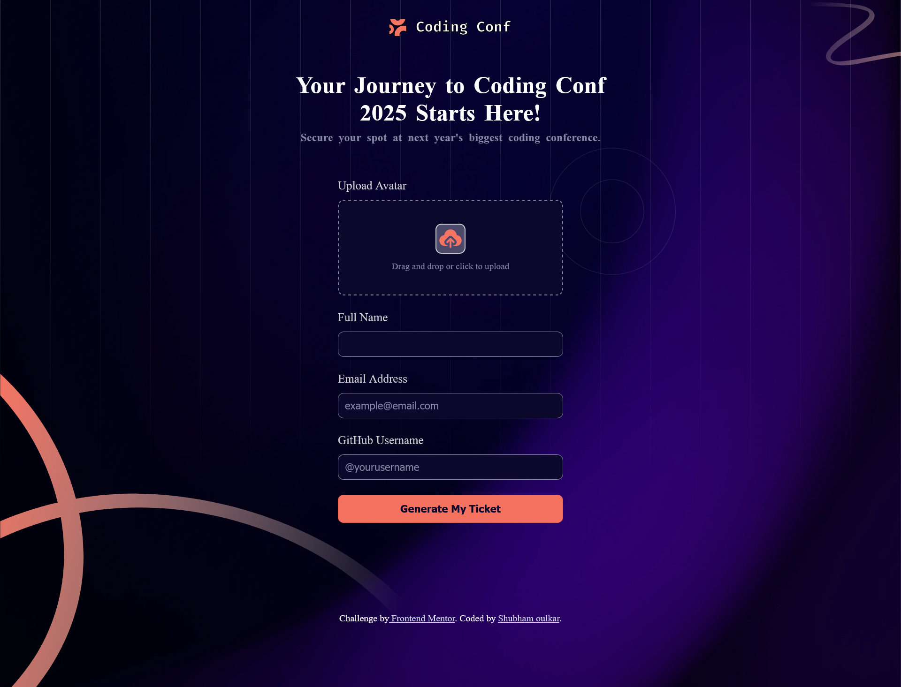
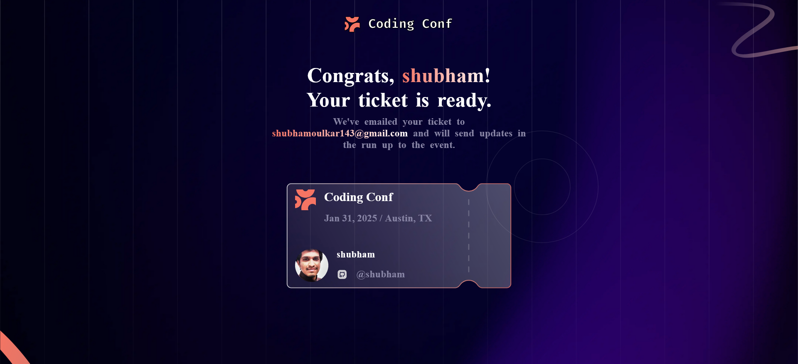
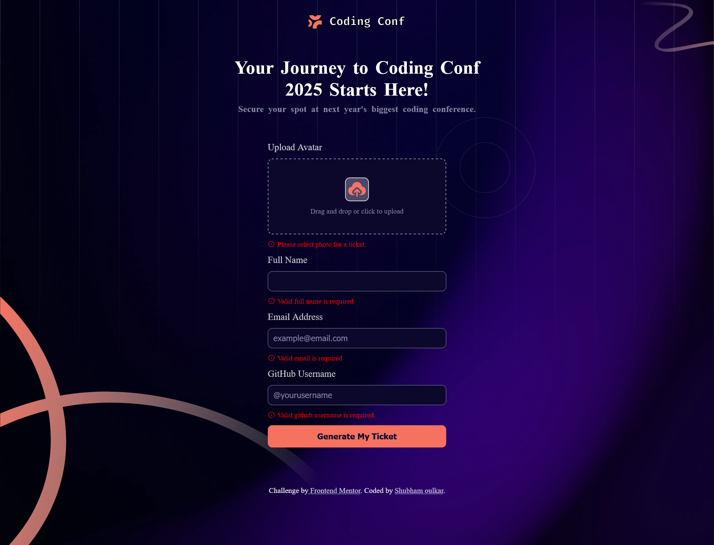
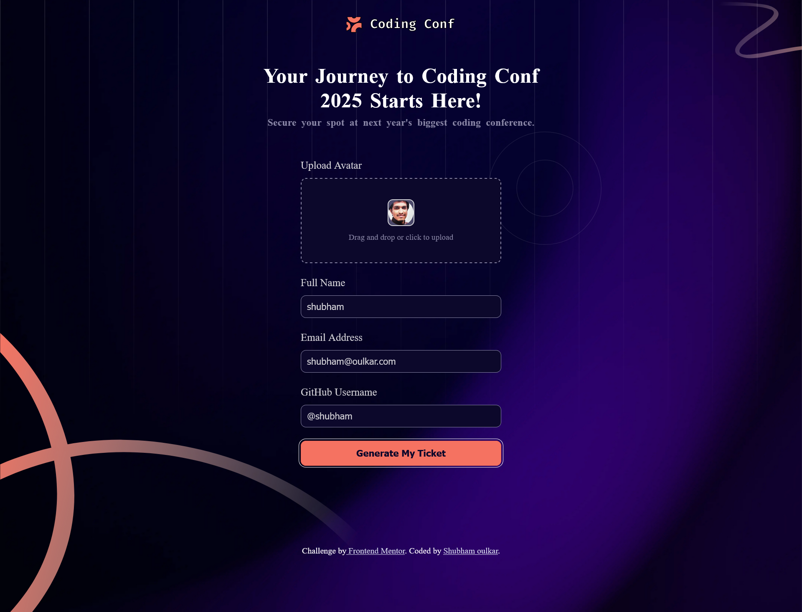
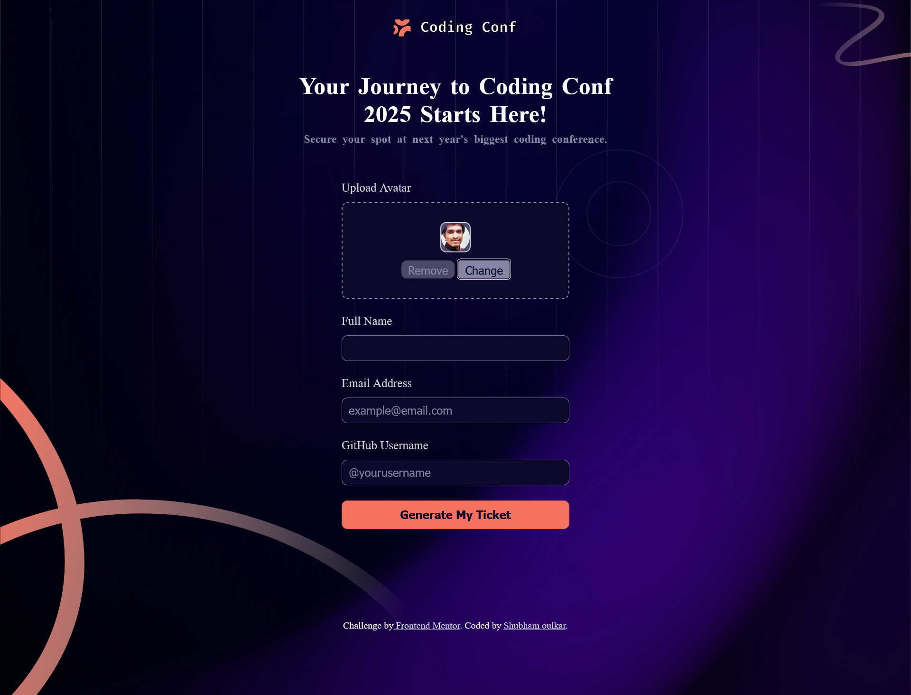

# Frontend Mentor - Conference ticket generator solution

This is a solution to the [Conference ticket generator challenge on Frontend Mentor](https://www.frontendmentor.io/challenges/conference-ticket-generator-oq5gFIU12w). Frontend Mentor challenges help you improve your coding skills by building realistic projects.

## Table of contents

- [Frontend Mentor - Conference ticket generator solution](#frontend-mentor---conference-ticket-generator-solution)
  - [Table of contents](#table-of-contents)
  - [Overview](#overview)
    - [The challenge](#the-challenge)
  - [My process](#my-process)
    - [Built with](#built-with)
    - [What I learned](#what-i-learned)
    - [Screenshot](#screenshot)

## Overview

### The challenge

Users should be able to:

- Complete the form with their details
- Receive form validation messages if:
  - Any field is missed
  - The email address is not formatted correctly
  - The avatar upload is too big or the wrong image format
- Complete the form only using their keyboard
- Have inputs, form field hints, and error messages announced on their screen reader
- See the generated conference ticket when they successfully submit the form
- View the optimal layout for the interface depending on their device's screen size
- See hover and focus states for all interactive elements on the page

## My process

### Built with

- Semantic HTML5 markup
- CSS custom properties
- Flexbox
- CSS Grid
- Mobile-first workflow
- [React](https://reactjs.org/) - JS library

### What I learned

I learned new react 19 hook useActionState. This hook reduces use of useState hook. Also no need to use third party form libraries for forms. This form is designed like react-hook-forms.

Following design specifications are achieved,

1. 50% less re-rendring of the forms
2. 8% Less bundle size
3. Mounting Phase:

- UseActionStateForm:
  - Actual Duration: 7.3 ms
  - Base Duration: 4.3 ms
  - Start Time: 1170.2 ms
- react hook Form:

  - Actual Duration: 4.9 ms
  - Base Duration: 3 ms
  - Start Time: 1135.7 ms

  ```
  react hook Form mounts faster than UseActionStateForm with a lower actual and base duration.
  ```

4. Update Phase:

- UseActionStateForm:
  - Actual Duration: 0.6 ms
  - Base Duration: 4.5 ms
  - Start Time: 124883.5 ms
- react hook Form:

  - Actual Duration: 2.3 ms
  - Base Duration: 2.3 ms
  - Start Time: 207708.4 ms

```

UseActionStateForm updates faster than react hook Form with a significantly lower actual duration.

```

5. Also I learned about clamp() function is ccs. This function reduces use of media query. Responsive pages are easy to design with clamp() especially font-size and widths.

### Screenshot






